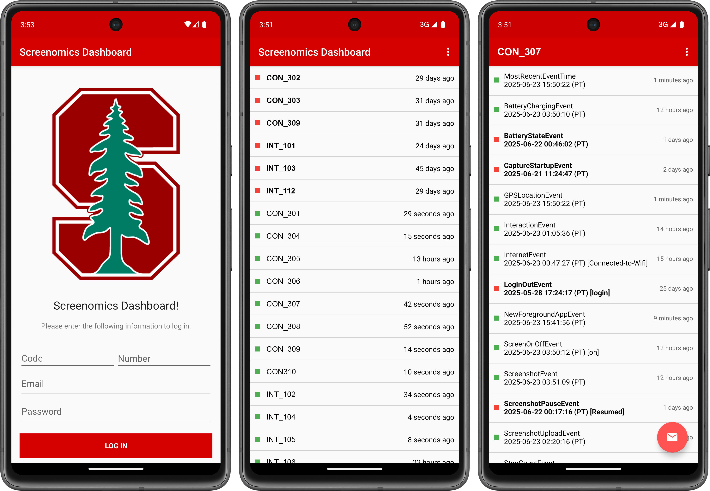

## 4.01. Screenomics Dashboard

The Screenomics Dashboard App is a lightweight companion tool designed to support real-time monitoring and participant management in studies conducted by the Stanford Screenomics Lab. Built with researchers in mind, the app provides a high-level overview of participant activity status using timestamped event data—referred to as the Ticker, a Firestore document that stores the most recent timestamp of each event type on a participant level [[Refer to Chapter 1. Firebase - 07.1. Ticker](../Ch1_Firebase/07_Ticker.md)]. 

The dashboard allows researchers to quickly identify inactive or problematic data streams, investigate event-level details, and initiate communication with participants when needed. With features like login credential reuse, visual activity markers, and a streamlined email interface, the Dashboard App ensures that researchers can proactively track data integrity and respond to technical or compliance issues with minimal friction. This chapter outlines the app’s core features and how to use them effectively for participant oversight and data quality assurance.

*Screenomics Dashboard App: Log-in interface, User List view, and Detailed View (left to right).*

---

### 04.01.1 Log-In

Upon launching the app, researchers are prompted to log-in. The login screen mirrors the design used in the Stanford Screenomics data collection app, and researchers can **authenticate using the same credentials** they created when registering for that app. If no researcher account has been created yet, one can be registered through the data collection app. This account can then be used by a research coordinator or anyone responsible for monitoring participant activity. Successful login takes the user to the User List View, the main interface of the Dashboard App.

---

### 04.01.2 User List View

The Screenomics Dashboard App is a participant monitoring and communication tool developed to support research conducted by the Stanford Screenomics Lab. It leverages ticker information, stored in a Firestore database, to provide real-time visibility into the status of data collection from each participant. 

In the main interface, users are presented with a list of participant usernames, each formatted as **group code + participant ID**. The list is **primarily ordered by activity status**, with participants who have been **inactive (red)** shown at the top to draw attention to potential follow-up needs. Within each status group (red or green), entries are sorted **alphabetically**.

Each entry is also prefixed by a color-coded status marker:
- **Green** indicates that the participant has submitted at least one data within the past 48 hours.
- **Red** indicates that all tracked events have been inactive for more than 48 hours and may require follow-up.

To the right of each username, a **“time ago”** label displays when the most recent event was recorded (e.g., “3 days ago”).

---

### 04.01.3 Detailed View

Tapping on a username opens the participant detail view, which lists the most recent timestamp for **each tracked event**. Although the ticker database may contain more event types, the dashboard currently displays:
- `MostRecentEventTime`
- `BatteryChargingEvent`
- `BatteryStateEvent`
- `CaptureStartupEvent`
- `GPSLocationEvent`
- `InteractionEvent`
- `InternetEvent`
  - `Connected-to-DataPlan`
  - `Disconnected-from-DataPlan`
  - `Connected-to-WiFi`
  - `Disconnected-from-WiFi`
- `LogInOutEvent`
  - `Login`
  - `Logout`
- `NewForegroundAppEvent`
- `ScreenOnOffEvent`
- `ScreenshotEvent`
- `ScreenshotPauseEvent`
  - `Paused`
  - `Resumed`
- `ScreenshotUploadEvent`
- `StepCountEvent`
- `SystemPowerEvent`

For each event:
- The right side shows how long ago the event was last observed (e.g., “1 hour ago”).
- The left side displays a green or red marker, indicating data freshness:
  - Green = event is active (last recorded within 48 hours)
  - Red = event is inactive (no data for 48+ hours)

Additionally, if an event has been inactive for over 24 hours, the event label is **bolded** for emphasis.

These event-level markers directly influence the overall status displayed in the user list view. A participant is marked red if all tracked events are inactive for more than 24 hours. For example, if screenshot recording has been paused by the participant three days ago, but all other streams remain active, only the screenshot event will show red — and the overall user status may still appear green.

Importantly, these status markers not only reflect *user engagement* but can also signal *technical issues*, such as:
- Background permission revocation by the Android system (e.g., Accessibility Services turned off)
- App interruptions that do not crash the app but silently halt data collection

**In such cases, the app may appear to be running normally, but data streams (like interaction logging) will silently stop.** The dashboard helps surface these hidden failures. When this occurs, researchers are encouraged to follow up with participants — in many cases, re-granting permissions restores data flow immediately.

---

### 04.01.4 Communication Support

The Screenomics Dashboard App includes a built-in communication feature to support timely outreach to participants. In the bottom-right corner of the participant detail view, an email icon allows researchers to quickly initiate a one-way email to the selected participant. When tapped, the app opens the researcher’s default email client (such as Outlook and Gmail) with the participant’s email address automatically populated. 

This feature is particularly useful when the dashboard indicates issues such as prolonged inactivity, missing data, or revoked permissions. While the Dashboard App does not support receiving replies, it enables rapid, personalized outreach without needing to look up participant contact information separately. Researchers are encouraged to customize the message content based on the situation (e.g., reminding the participant to reopen the app or re-enable accessibility services).

**Use of this feature should comply with your IRB-approved communication protocols and participant privacy guidelines.**

[Back to Top](#top)

